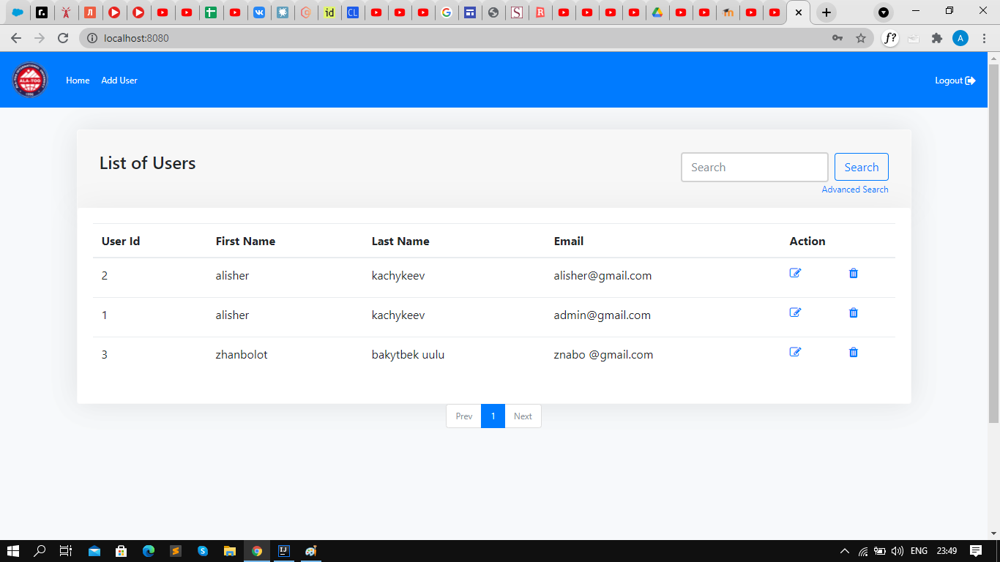
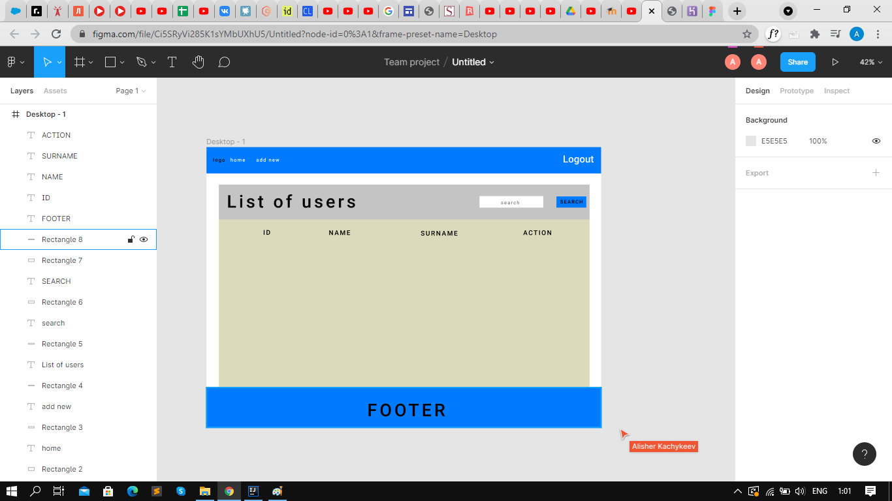
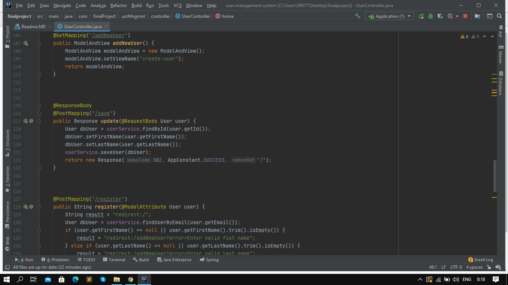
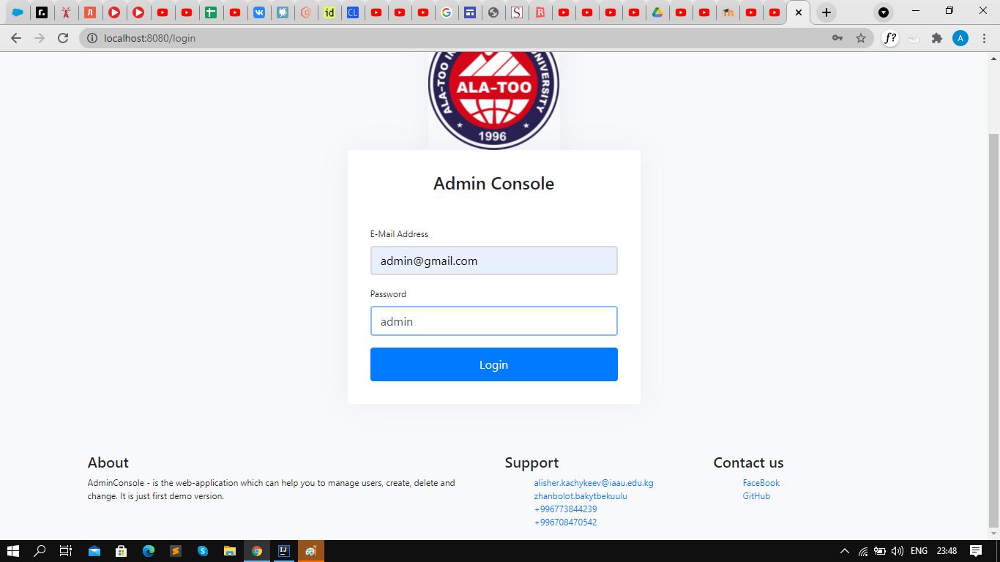
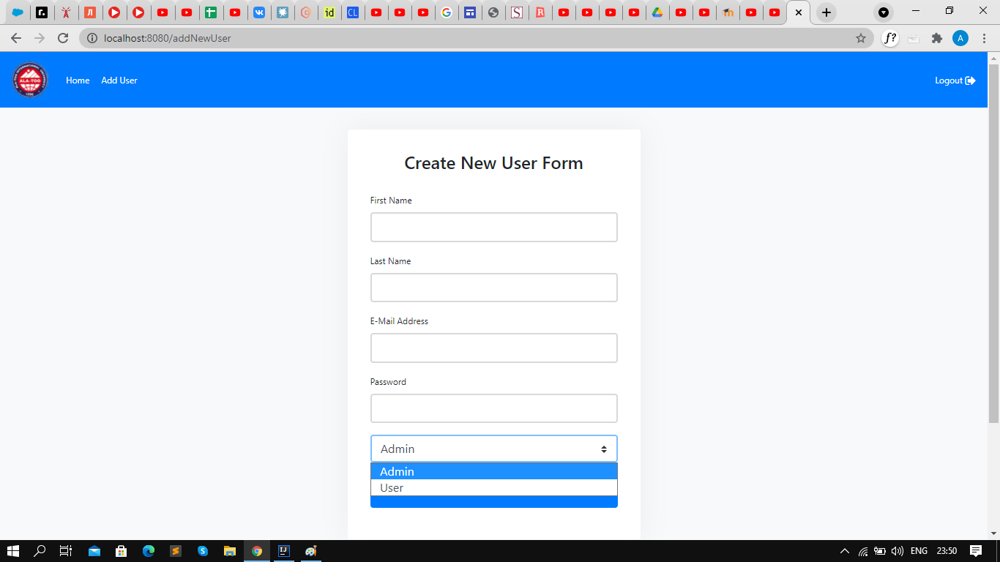
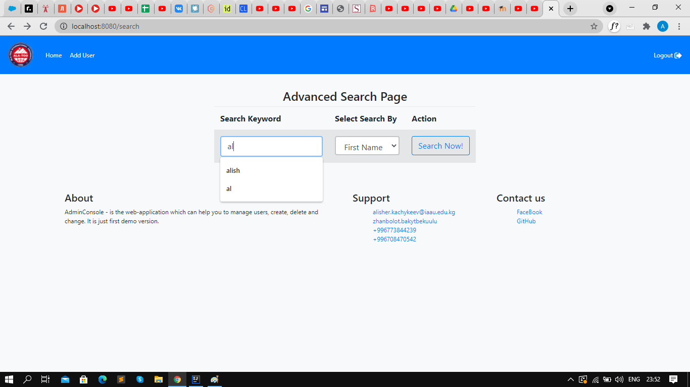
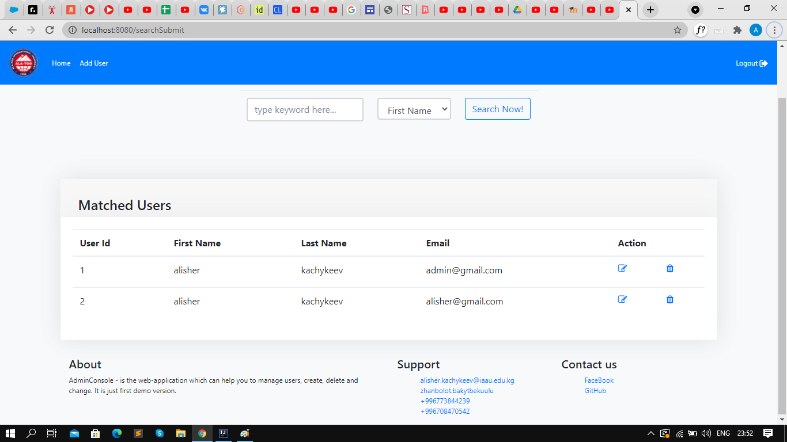

# Project description.
* This simple Spring Boot Project is Admin management for admins to perform operations on users.

## Heroku link
* https://final2021project.herokuapp.com/
## Figma link
* https://www.figma.com/file/Ci5SRyVi285K1sYMbUXhU5/Untitled?node-id=0%3A1
Here is only home page, because on login page there is only email and password field.

## Team
* Alisher Kachykeev com19
* Zhanbolot bakytbek uulu com19
  
## What we used
* H2 database
* Bootstrap
* Spring
* Spring security
* JS
* Spring auth

## When the application starts you can access on heroku as:
    username: admin@gmail.com
    password: admin
 
## API description
* To access data by REST API entry point is /
* To go to searchbar do a GET request /searchBox
* To add new user do a POST request /addNewUser
* To register do a POST request /register
* To delete user by id do GET request  /delete/{userId}  
* To remove all users do GET request /removeAll
* To go to error page do GET request /error

Here is just a little part of API requests

## Here is other screen-shots.

